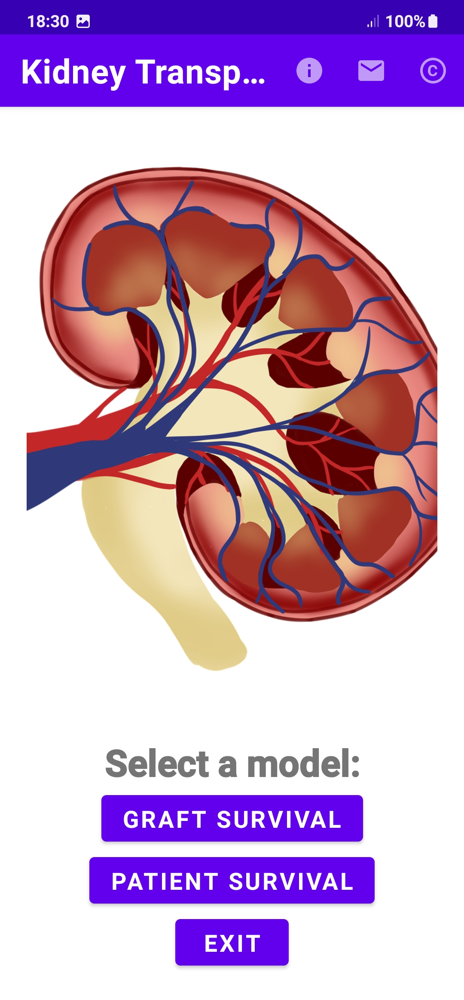
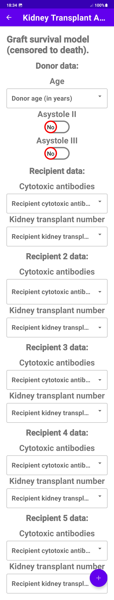
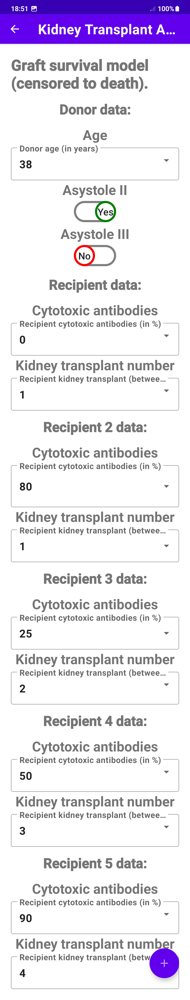
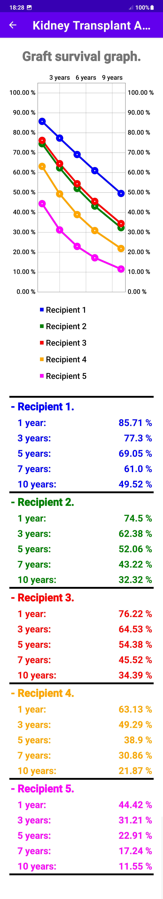
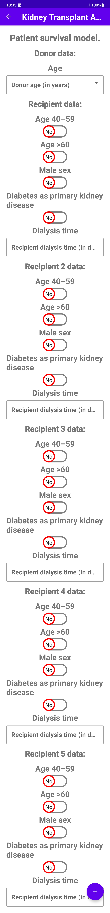
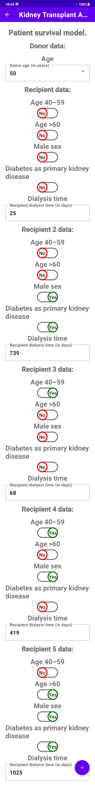
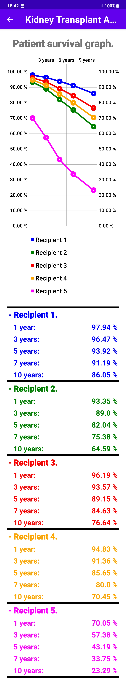

# KidneyTransplantApp.
## Summary.
The Kidney Transplant App has been developed as a result of a final degree project. There was a need for a useful and usable tool that allows nephrologists and health personnel to know the recipient's survival over time after a kidney transplant.
This application uses an API to obtain graft survival and patient survival results from a REST service. Both mathematical models have been developed in a joint effort of the Nephrology Service of the Virgen del Rocío University Hospital and the Biomedical Engineering Group of the University of Seville.

Please note that the REST service that runs in conjunction with this application, while fully developed, is not currently running. As a consequence, all the functionalities of the application are not currently available. 

## Sreenshots.
| Kidney Transplant App  |
| ------------- |
|   |

| Graft survival model: No Data | Graft survival model: Data | Graft survival model: Results |
| ------------- | ------------- | ------------- |
| |  |    |

| Patient survival model: No Data | Patient survival model: Data | Patient survival model: Results |
| ------------- | ------------- | ------------- |
| |  |    |

## Licenses.
#### Kidney Transplant App (Android application) license:
Copyright Daniel Portero Barreña, Jorge Calvillo Arbizu, Miguel Ángel Pérez Valdivia.

Application code download is allowed.

For any other use of the application code, please contact the authors.

#### Kidney Transplant App image license:
https://pixabay.com/illustrations/kidney-anatomy-body-part-medical-6694025

https://pixabay.com/service/license 

#### Kidney Transplant App icons licence:
https://google.github.io/material-design-icons 

https://www.apache.org/licenses/LICENSE-2.0 

#### MPAndroidChart library license:
https://github.com/PhilJay/MPAndroidChart 

https://www.apache.org/licenses/LICENSE-2.0 

#### Volley library license:
https://github.com/google/volley 

https://www.apache.org/licenses/LICENSE-2.0 
